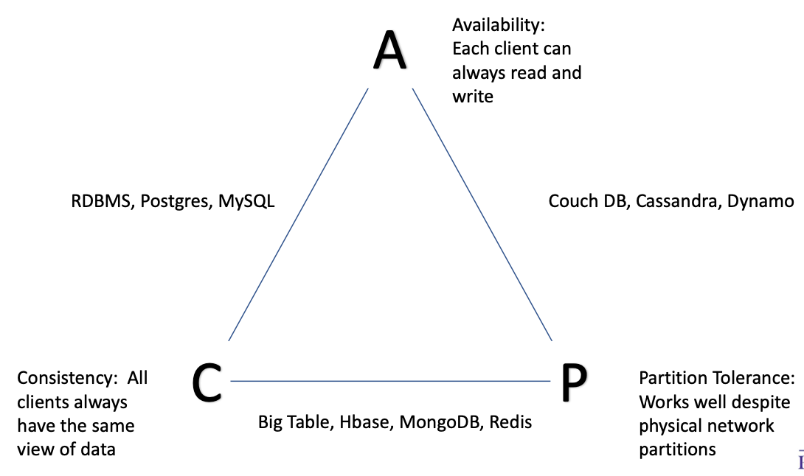
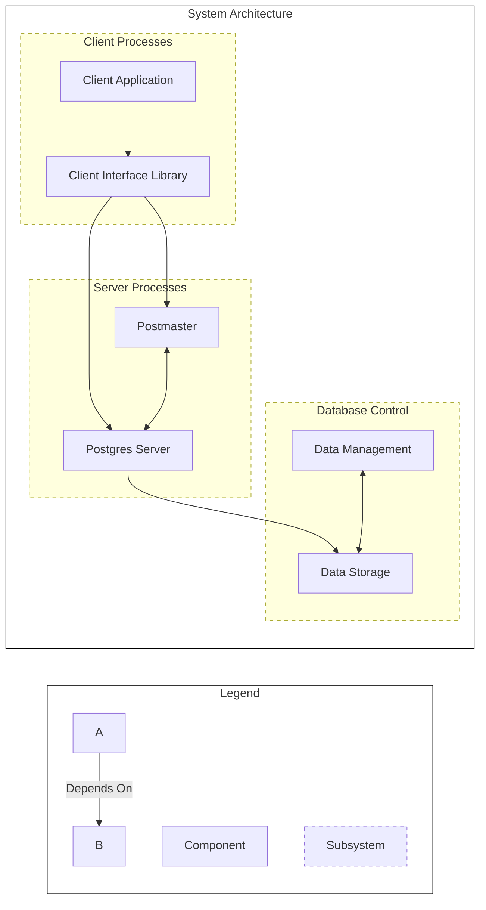
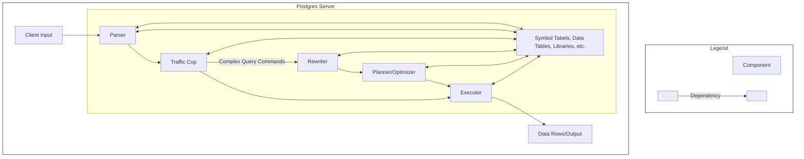

# General Design

- Object oriented in three subsystems
  1. Client/Server (Front End)
  2. Server processes
  3. Database control

# CAP Theorem

- 

# System Architecture

# Client Server

- Two main parts
  1. Client application
  2. Client interface library
- Many different applications
- Client Interface Library is how they talk to the server

# Postmaster

- Daemon thread that runs constantly
- Implicit invocation architecture to listen for any and all database calls
- When it receives client call, creates a back-end process (server) to match it with 1-to-1 correspondence

# Server Architecture

# Parser

-  Accepts an SQL query as ASCII text
- *lexar* does pattern matching
- *parser* then assembles into a parse tree (order of operations)
- *parser* then checks that query has valid syntax

# Rewriter

- Lookup rules
- Lookup view definitions

# Planner

- Creates optimal execution plan

# Executor

- Receives plan from planner in tree form
- Extracts necessary data tables
- Recursively goes through plan and executes
- Pipe and filter, *not* batch processing
- Return output

# Catalogs

- Postgres is catalog-driven, moreso than others
- Catalogs describe tables, their columns, indexes, etc
- Also use system catalogs to store info about datatypes, functions, operators, index access methods, etc

# Features

- Complex queries
- Foreign keys
- Triggers
- Updateable views
- Transactional integrity
- Multiversion concurrency control

# Extensibility

- Data Types
- Functions
- Operators
- Aggregate functions
- Index Methods
- Procedural Languages