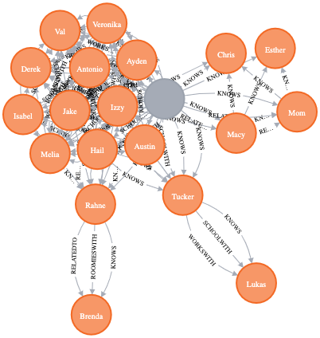
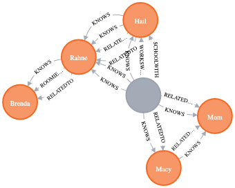
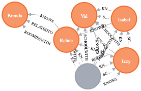
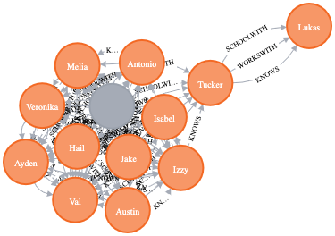
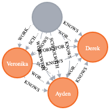
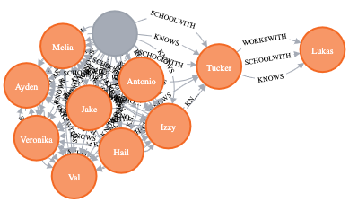

# Homework 4

Gus Lipkin

> This graph database represents the people I talk to on a daily basis. Some are coworkers, friends, family, or fill multiple roles.

## Code

```cypher
CREATE (me:Person { name: "Gus", 
                    from: "Boston", 
                    worksAt: "SGA, SDC", 
                    schoolAt: "Florida Poly"})

CREATE  (hs:Person { name: "Hail", 
                     from: "Spring Hill", 
                     worksAt: "SGA",
                     schoolAt: "Florida Poly" }),
               			(gl)-[:KNOWS]->(hs), (gl)-[:WORKSWITH]->(hs), (gl)-[:SCHOOLWITH]->(hs),
				(aa:Person { name: "Austin", 
                     from: "San Francisco", 
                     schoolAt: "Florida Poly" }),
                     (gl)-[:KNOWS]->(aa), (gl)-[:SCHOOLWITH]->(aa),
                     (hs)-[:KNOWS]->(aa), (hs)-[:SCHOOLWITH]->(aa),
				(jg:Person { name: "Jake", 
                     from: "Miami", 
                     worksAt: "SGA, Draken",
                     schoolAt: "Florida Poly" }),
                     (gl)-[:KNOWS]->(jg), (gl)-[:WORKSWITH]->(jg), (gl)-[:SCHOOLWITH]->(jg),
				(imz:Person { name: "Izzy", 
                      from: "Boca Raton", 
                      worksAt: "Draken",
                      schoolAt: "Florida Poly" }),
                      (gl)-[:KNOWS]->(imz), (gl)-[:SCHOOLWITH]->(imz), (gl)-[:ROOMIESWITH]->(imz),
                      (aa)-[:KNOWS]->(imz), (aa)-[:SCHOOLWITH]->(imz),
                      (hs)-[:KNOWS]->(imz), (hs)-[:SCHOOLWITH]->(imz),
                      (jg)-[:KNOWS]->(imz), (jg)-[:WORKSWITH]->(imz), (jg)-[:SCHOOLWITH]->(imz),
        (ts:Person { name: "Tucker",
                     from: "Jupiter",
                     worksAt: "M&M Systems",
                     schoolAt: "Florida Poly" }),
                     (gl)-[:KNOWS]->(ts), (gl)-[:SCHOOLWITH]->(ts),
                     (hs)-[:KNOWS]->(ts),
                     (imz)-[:KNOWS]->(ts),
        (lm:Person { name: "Lukas",
                     from: "Jupiter",
                     worksAt: "M&M Systems",
                     schoolAt: "Florida Poly" }),
                     (gl)-[:KNOWS]->(ts), (gl)-[:SCHOOLWITH]->(ts),
                     (hs)-[:KNOWS]->(ts),
                     (ts)-[:KNOWS]->(lm), (ts)-[:WORKSWITH]->(lm), (ts)-[:SCHOOLWITH]->(lm),
        (ml:Person { name: "Macy",
                     from: "Boston",
                     worksAt: "NENC",
                     schoolAt: "Wellesley" }),
                     (gl)-[:KNOWS]->(ml), (gl)-[:RELATEDTO]->(ml), 
                     (imz)-[:KNOWS]->(ml),
        (m:Person { name: "Mom",
                     from: "Commack",
                     worksAt: "Mass DPH",
                     schoolAt: "Oberlin" }),
                     (gl)-[:KNOWS]->(m), (gl)-[:RELATEDTO]->(m), 
                     (ml)-[:KNOWS]->(m), (ml)-[:RELATEDTO]->(m),
        (eh:Person { name: "Esther",
                     from: "Long Island"}),
                     (gl)-[:KNOWS]->(eh), 
                     (ml)-[:KNOWS]->(eh), 
                     (m)-[:KNOWS]->(eh), 
        (iz:Person { name: "Isabel",
                     from: "Peoria",
                     worksAt: "RStudio",
                     schoolAt: "Florida Poly" }),
                     (gl)-[:KNOWS]->(imz), (gl)-[:SCHOOLWITH]->(iz), 
                     (aa)-[:KNOWS]->(imz), (aa)-[:SCHOOLWITH]->(iz),
                     (hs)-[:KNOWS]->(imz), (hs)-[:SCHOOLWITH]->(iz),
                     (jg)-[:KNOWS]->(imz), (jg)-[:SCHOOLWITH]->(imz),
                     (imz)-[:KNOWS]->(iz), (imz)-[:SCHOOLWITH]->(iz),
        (ch:Person { name: "Chris",
                     from: "Boston",
                     worksAt: "MSA",
                     schoolAt: "Bates" }),
                     (gl)-[:KNOWS]->(ch), 
                     (ml)-[:KNOWS]->(ch), 
                     (m)-[:KNOWS]->(ch),
                     (imz)-[:KNOWS]->(ch),
        (ah:Person { name: "Antonio",
                     from: "Tampa",
                     worksAt: "SGA",
                     schoolAt: "Florida Poly" }),
                     (gl)-[:KNOWS]->(ah), (gl)-[:SCHOOLWITH]->(ah), (gl)-[:WORKSWITH]->(ah),
                     (aa)-[:SCHOOLWITH]->(ah),
                     (hs)-[:KNOWS]->(ah), (hs)-[:SCHOOLWITH]->(ah), (hs)-[:WORKSWITH]->(ah),
                     (jg)-[:KNOWS]->(ah), (jg)-[:SCHOOLWITH]->(ah), (jg)-[:WORKSWITH]->(ah),
                     (imz)-[:SCHOOLWITH]->(ah),
                     (iz)-[:SCHOOLWITH]->(ah),
        (mr:Person { name: "Melia",
                     from: "Boca Raton",
                     worksAt: "SGA",
                     schoolAt: "Florida Poly" }),
                     (gl)-[:KNOWS]->(mr), (gl)-[:SCHOOLWITH]->(mr), (gl)-[:WORKSWITH]->(mr),
                     (aa)-[:SCHOOLWITH]->(mr),
                     (hs)-[:KNOWS]->(mr), (hs)-[:SCHOOLWITH]->(mr), (hs)-[:WORKSWITH]->(mr),
                     (jg)-[:KNOWS]->(mr), (jg)-[:SCHOOLWITH]->(mr), (jg)-[:WORKSWITH]->(mr),
                     (imz)-[:KNOWS]->(mr), (imz)-[:SCHOOLWITH]->(mr),
                     (iz)-[:SCHOOLWITH]->(mr),
                     (ah)-[:KNOWS]->(mr), (ah)-[:SCHOOLWITH]->(mr), (ah)-[:WORKSWITH]->(mr),
        (vp:Person { name: "Veronika",
                     worksAt: "SDC",
                     schoolAt: "Florida Poly" }),
                     (gl)-[:KNOWS]->(vp), (gl)-[:SCHOOLWITH]->(vp), (gl)-[:WORKSWITH]->(vp),
                     (aa)-[:SCHOOLWITH]->(vp),
                     (hs)-[:KNOWS]->(vp), (hs)-[:SCHOOLWITH]->(vp),
                     (jg)-[:SCHOOLWITH]->(vp),
                     (imz)-[:KNOWS]->(vp), (imz)-[:SCHOOLWITH]->(vp),
                     (iz)-[:KNOWS]->(vp), (iz)-[:SCHOOLWITH]->(vp),
                     (ah)-[:SCHOOLWITH]->(vp),
                     (mr)-[:KNOWS]->(vp), (mr)-[:SCHOOLWITH]->(vp),
        (al:Person { name: "Ayden",
                     from: "Tallahassee",
                     worksAt: "SDC",
                     schoolAt: "Florida Poly" }),
                     (gl)-[:KNOWS]->(al), (gl)-[:SCHOOLWITH]->(al), (gl)-[:WORKSWITH]->(al),
                     (aa)-[:SCHOOLWITH]->(al),
                     (hs)-[:SCHOOLWITH]->(al),
                     (jg)-[:SCHOOLWITH]->(al),
                     (imz)-[:KNOWS]->(al), (imz)-[:SCHOOLWITH]->(al),
                     (iz)-[:SCHOOLWITH]->(al),
                     (ah)-[:SCHOOLWITH]->(al),
                     (mr)-[:SCHOOLWITH]->(al),
                     (vp)-[:KNOWS]->(al), (vp)-[:SCHOOLWITH]->(al), (vp)-[:WORKSWITH]->(al),
        (vc:Person { name: "Val",
                     worksAt: "SDC",
                     schoolAt: "Florida Poly" }),
                     (gl)-[:KNOWS]->(vc), (gl)-[:SCHOOLWITH]->(vc), (gl)-[:WORKSWITH]->(vc),
                     (aa)-[:SCHOOLWITH]->(vc),
                     (hs)-[:KNOWS]->(vc), (hs)-[:SCHOOLWITH]->(vc),
                     (jg)-[:KNOWS]->(vc), (jg)-[:SCHOOLWITH]->(vc),
                     (imz)-[:KNOWS]->(vc), (imz)-[:SCHOOLWITH]->(vc),
                     (iz)-[:KNOWS]->(vc), (iz)-[:SCHOOLWITH]->(vc), (iz)-[:ROOMIESWITH]->(vc),
                     (ah)-[:KNOWS]->(vc), (ah)-[:SCHOOLWITH]->(al),
                     (mr)-[:KNOWS]->(vc), (mr)-[:SCHOOLWITH]->(al),
                     (vp)-[:KNOWS]->(vc), (vp)-[:SCHOOLWITH]->(vc), (vp)-[:WORKSWITH]->(vc),
                     (al)-[:KNOWS]->(vc), (al)-[:SCHOOLWITH]->(vc), (al)-[:WORKSWITH]->(vc),
        (dl:Person { name: "Derek",
                     from: "Lakeland",
                     worksAt: "SDC",
                     schoolAt: "UCF" }),
                     (gl)-[:KNOWS]->(dl), (gl)-[:WORKSFOR]->(dl),
                     (hs)-[:KNOWS]->(dl), 
                     (jg)-[:KNOWS]->(dl),
                     (imz)-[:KNOWS]->(dl),
                     (iz)-[:KNOWS]->(dl),
                     (ah)-[:KNOWS]->(dl),
                     (mr)-[:KNOWS]->(dl),
                     (vp)-[:KNOWS]->(dl), (vp)-[:WORKSFOR]->(dl),
                     (al)-[:KNOWS]->(dl), (al)-[:WORKSFOR]->(dl),
        (rs:Person { name: "Rahne",
                     from: "Spring Hill",
                     worksAt: "TGH" }),
                     (gl)-[:KNOWS]->(rs),
                     (hs)-[:KNOWS]->(rs), (hs)-[:RELATEDTO]->(rs),
                     (jg)-[:KNOWS]->(rs),
                     (imz)-[:KNOWS]->(rs),
                     (iz)-[:KNOWS]->(rs),
                     (mr)-[:KNOWS]->(rs),
        (bs:Person { name: "Brenda",
                     from: "Boston",
                     worksAt: "FCC" }),
                     (gl)-[:KNOWS]->(rs),
                     (hs)-[:KNOWS]->(rs), (hs)-[:RELATEDTO]->(rs),
                     (rs)-[:KNOWS]->(bs), (rs)-[:RELATEDTO]->(bs), (rs)-[:ROOMIESWITH]->(bs)
                                                                                         
MATCH p=()-[r:KNOWS]->() RETURN p
MATCH p=()-[r:RELATEDTO]->() RETURN p
MATCH p=()-[r:ROOMIESWITH]->() RETURN p
MATCH p=()-[r:SCHOOLWITH]->() RETURN p
MATCH p=()-[r:WORKSFOR]->() RETURN p
MATCH p=()-[r:WORKSWITH]->() RETURN p
```

## Code and Results

### Initial Setup

```cypher
CREATE (me:Person { name: "Gus", 
                    from: "Boston", 
                    worksAt: "SGA, SDC", 
                    schoolAt: "Florida Poly"})

CREATE  (hs:Person { name: "Hail", 
                     from: "Spring Hill", 
                     worksAt: "SGA",
                     schoolAt: "Florida Poly" }),
               			(gl)-[:KNOWS]->(hs), (gl)-[:WORKSWITH]->(hs), (gl)-[:SCHOOLWITH]->(hs),
				(aa:Person { name: "Austin", 
                     from: "San Francisco", 
                     schoolAt: "Florida Poly" }),
                     (gl)-[:KNOWS]->(aa), (gl)-[:SCHOOLWITH]->(aa),
                     (hs)-[:KNOWS]->(aa), (hs)-[:SCHOOLWITH]->(aa),
				(jg:Person { name: "Jake", 
                     from: "Miami", 
                     worksAt: "SGA, Draken",
                     schoolAt: "Florida Poly" }),
                     (gl)-[:KNOWS]->(jg), (gl)-[:WORKSWITH]->(jg), (gl)-[:SCHOOLWITH]->(jg),
				(imz:Person { name: "Izzy", 
                      from: "Boca Raton", 
                      worksAt: "Draken",
                      schoolAt: "Florida Poly" }),
                      (gl)-[:KNOWS]->(imz), (gl)-[:SCHOOLWITH]->(imz), (gl)-[:ROOMIESWITH]->(imz),
                      (aa)-[:KNOWS]->(imz), (aa)-[:SCHOOLWITH]->(imz),
                      (hs)-[:KNOWS]->(imz), (hs)-[:SCHOOLWITH]->(imz),
                      (jg)-[:KNOWS]->(imz), (jg)-[:WORKSWITH]->(imz), (jg)-[:SCHOOLWITH]->(imz),
        (ts:Person { name: "Tucker",
                     from: "Jupiter",
                     worksAt: "M&M Systems",
                     schoolAt: "Florida Poly" }),
                     (gl)-[:KNOWS]->(ts), (gl)-[:SCHOOLWITH]->(ts),
                     (hs)-[:KNOWS]->(ts),
                     (imz)-[:KNOWS]->(ts),
        (lm:Person { name: "Lukas",
                     from: "Jupiter",
                     worksAt: "M&M Systems",
                     schoolAt: "Florida Poly" }),
                     (gl)-[:KNOWS]->(ts), (gl)-[:SCHOOLWITH]->(ts),
                     (hs)-[:KNOWS]->(ts),
                     (ts)-[:KNOWS]->(lm), (ts)-[:WORKSWITH]->(lm), (ts)-[:SCHOOLWITH]->(lm),
        (ml:Person { name: "Macy",
                     from: "Boston",
                     worksAt: "NENC",
                     schoolAt: "Wellesley" }),
                     (gl)-[:KNOWS]->(ml), (gl)-[:RELATEDTO]->(ml), 
                     (imz)-[:KNOWS]->(ml),
        (m:Person { name: "Mom",
                     from: "Commack",
                     worksAt: "Mass DPH",
                     schoolAt: "Oberlin" }),
                     (gl)-[:KNOWS]->(m), (gl)-[:RELATEDTO]->(m), 
                     (ml)-[:KNOWS]->(m), (ml)-[:RELATEDTO]->(m),
        (eh:Person { name: "Esther",
                     from: "Long Island"}),
                     (gl)-[:KNOWS]->(eh), 
                     (ml)-[:KNOWS]->(eh), 
                     (m)-[:KNOWS]->(eh), 
        (iz:Person { name: "Isabel",
                     from: "Peoria",
                     worksAt: "RStudio",
                     schoolAt: "Florida Poly" }),
                     (gl)-[:KNOWS]->(imz), (gl)-[:SCHOOLWITH]->(iz), 
                     (aa)-[:KNOWS]->(imz), (aa)-[:SCHOOLWITH]->(iz),
                     (hs)-[:KNOWS]->(imz), (hs)-[:SCHOOLWITH]->(iz),
                     (jg)-[:KNOWS]->(imz), (jg)-[:SCHOOLWITH]->(imz),
                     (imz)-[:KNOWS]->(iz), (imz)-[:SCHOOLWITH]->(iz),
        (ch:Person { name: "Chris",
                     from: "Boston",
                     worksAt: "MSA",
                     schoolAt: "Bates" }),
                     (gl)-[:KNOWS]->(ch), 
                     (ml)-[:KNOWS]->(ch), 
                     (m)-[:KNOWS]->(ch),
                     (imz)-[:KNOWS]->(ch),
        (ah:Person { name: "Antonio",
                     from: "Tampa",
                     worksAt: "SGA",
                     schoolAt: "Florida Poly" }),
                     (gl)-[:KNOWS]->(ah), (gl)-[:SCHOOLWITH]->(ah), (gl)-[:WORKSWITH]->(ah),
                     (aa)-[:SCHOOLWITH]->(ah),
                     (hs)-[:KNOWS]->(ah), (hs)-[:SCHOOLWITH]->(ah), (hs)-[:WORKSWITH]->(ah),
                     (jg)-[:KNOWS]->(ah), (jg)-[:SCHOOLWITH]->(ah), (jg)-[:WORKSWITH]->(ah),
                     (imz)-[:SCHOOLWITH]->(ah),
                     (iz)-[:SCHOOLWITH]->(ah),
        (mr:Person { name: "Melia",
                     from: "Boca Raton",
                     worksAt: "SGA",
                     schoolAt: "Florida Poly" }),
                     (gl)-[:KNOWS]->(mr), (gl)-[:SCHOOLWITH]->(mr), (gl)-[:WORKSWITH]->(mr),
                     (aa)-[:SCHOOLWITH]->(mr),
                     (hs)-[:KNOWS]->(mr), (hs)-[:SCHOOLWITH]->(mr), (hs)-[:WORKSWITH]->(mr),
                     (jg)-[:KNOWS]->(mr), (jg)-[:SCHOOLWITH]->(mr), (jg)-[:WORKSWITH]->(mr),
                     (imz)-[:KNOWS]->(mr), (imz)-[:SCHOOLWITH]->(mr),
                     (iz)-[:SCHOOLWITH]->(mr),
                     (ah)-[:KNOWS]->(mr), (ah)-[:SCHOOLWITH]->(mr), (ah)-[:WORKSWITH]->(mr),
        (vp:Person { name: "Veronika",
                     worksAt: "SDC",
                     schoolAt: "Florida Poly" }),
                     (gl)-[:KNOWS]->(vp), (gl)-[:SCHOOLWITH]->(vp), (gl)-[:WORKSWITH]->(vp),
                     (aa)-[:SCHOOLWITH]->(vp),
                     (hs)-[:KNOWS]->(vp), (hs)-[:SCHOOLWITH]->(vp),
                     (jg)-[:SCHOOLWITH]->(vp),
                     (imz)-[:KNOWS]->(vp), (imz)-[:SCHOOLWITH]->(vp),
                     (iz)-[:KNOWS]->(vp), (iz)-[:SCHOOLWITH]->(vp),
                     (ah)-[:SCHOOLWITH]->(vp),
                     (mr)-[:KNOWS]->(vp), (mr)-[:SCHOOLWITH]->(vp),
        (al:Person { name: "Ayden",
                     from: "Tallahassee",
                     worksAt: "SDC",
                     schoolAt: "Florida Poly" }),
                     (gl)-[:KNOWS]->(al), (gl)-[:SCHOOLWITH]->(al), (gl)-[:WORKSWITH]->(al),
                     (aa)-[:SCHOOLWITH]->(al),
                     (hs)-[:SCHOOLWITH]->(al),
                     (jg)-[:SCHOOLWITH]->(al),
                     (imz)-[:KNOWS]->(al), (imz)-[:SCHOOLWITH]->(al),
                     (iz)-[:SCHOOLWITH]->(al),
                     (ah)-[:SCHOOLWITH]->(al),
                     (mr)-[:SCHOOLWITH]->(al),
                     (vp)-[:KNOWS]->(al), (vp)-[:SCHOOLWITH]->(al), (vp)-[:WORKSWITH]->(al),
        (vc:Person { name: "Val",
                     worksAt: "SDC",
                     schoolAt: "Florida Poly" }),
                     (gl)-[:KNOWS]->(vc), (gl)-[:SCHOOLWITH]->(vc), (gl)-[:WORKSWITH]->(vc),
                     (aa)-[:SCHOOLWITH]->(vc),
                     (hs)-[:KNOWS]->(vc), (hs)-[:SCHOOLWITH]->(vc),
                     (jg)-[:KNOWS]->(vc), (jg)-[:SCHOOLWITH]->(vc),
                     (imz)-[:KNOWS]->(vc), (imz)-[:SCHOOLWITH]->(vc),
                     (iz)-[:KNOWS]->(vc), (iz)-[:SCHOOLWITH]->(vc), (iz)-[:ROOMIESWITH]->(vc),
                     (ah)-[:KNOWS]->(vc), (ah)-[:SCHOOLWITH]->(al),
                     (mr)-[:KNOWS]->(vc), (mr)-[:SCHOOLWITH]->(al),
                     (vp)-[:KNOWS]->(vc), (vp)-[:SCHOOLWITH]->(vc), (vp)-[:WORKSWITH]->(vc),
                     (al)-[:KNOWS]->(vc), (al)-[:SCHOOLWITH]->(vc), (al)-[:WORKSWITH]->(vc),
        (dl:Person { name: "Derek",
                     from: "Lakeland",
                     worksAt: "SDC",
                     schoolAt: "UCF" }),
                     (gl)-[:KNOWS]->(dl), (gl)-[:WORKSFOR]->(dl),
                     (hs)-[:KNOWS]->(dl), 
                     (jg)-[:KNOWS]->(dl),
                     (imz)-[:KNOWS]->(dl),
                     (iz)-[:KNOWS]->(dl),
                     (ah)-[:KNOWS]->(dl),
                     (mr)-[:KNOWS]->(dl),
                     (vp)-[:KNOWS]->(dl), (vp)-[:WORKSFOR]->(dl),
                     (al)-[:KNOWS]->(dl), (al)-[:WORKSFOR]->(dl),
        (rs:Person { name: "Rahne",
                     from: "Spring Hill",
                     worksAt: "TGH" }),
                     (gl)-[:KNOWS]->(rs),
                     (hs)-[:KNOWS]->(rs), (hs)-[:RELATEDTO]->(rs),
                     (jg)-[:KNOWS]->(rs),
                     (imz)-[:KNOWS]->(rs),
                     (iz)-[:KNOWS]->(rs),
                     (mr)-[:KNOWS]->(rs),
        (bs:Person { name: "Brenda",
                     from: "Boston",
                     worksAt: "FCC" }),
                     (gl)-[:KNOWS]->(rs),
                     (hs)-[:KNOWS]->(rs), (hs)-[:RELATEDTO]->(rs),
                     (rs)-[:KNOWS]->(bs), (rs)-[:RELATEDTO]->(bs), (rs)-[:ROOMIESWITH]->(bs)
```

### Returning Queries

``` cypher
MATCH p=()-[r:KNOWS]->() RETURN p
```



```cypher
MATCH p=()-[r:RELATEDTO]->() RETURN p
```



I couldn’t figure out how to get this one to only show people that are related to each other and not put everyone that is related to someone else together.

```cypher
MATCH p=()-[r:ROOMIESWITH]->() RETURN p
```



Same problem as above on this one.

```cypher
MATCH p=()-[r:SCHOOLWITH]->() RETURN p
```



```cypher
MATCH p=()-[r:WORKSFOR]->() RETURN p
```



```cypher
MATCH p=()-[r:WORKSWITH]->() RETURN p
```



Same problem here too.