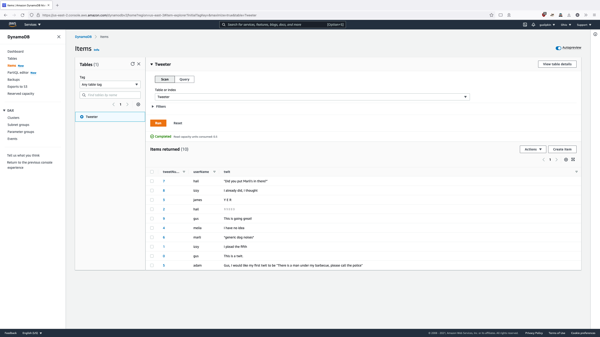
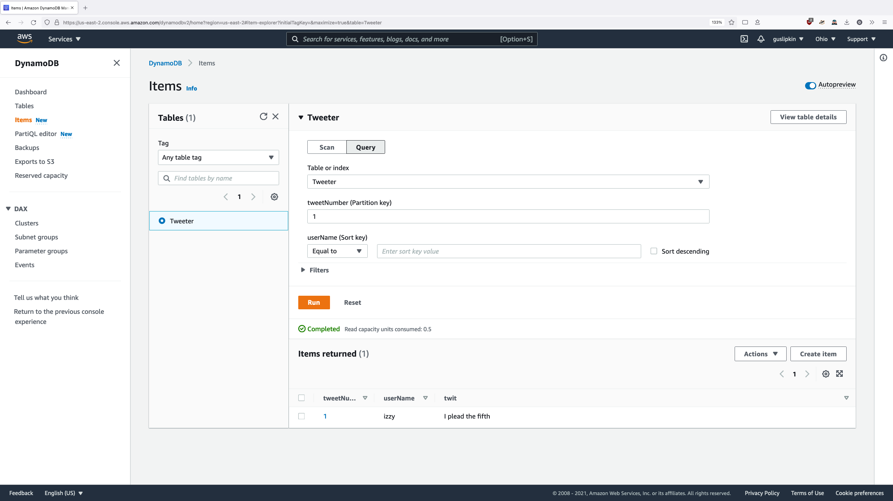
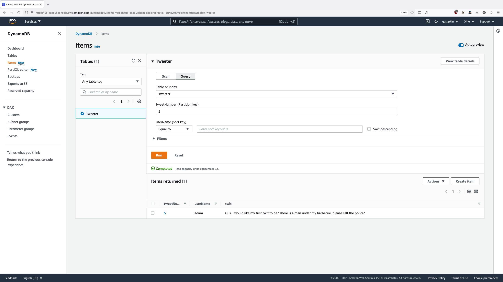

# Homework 4

Gus Lipkin

## After Initial Setup

| Name    | Status | Partition key        | Sort key          | Indexes | Read capacity mode | Write capacity mode | Encrpytion |
| ------- | ------ | -------------------- | ----------------- | ------- | ------------------ | ------------------- | ---------- |
| Tweeter | Active | tweetNumber (Number) | userName (String) | 0       | Provisioned (1)    | Provisioned (1)     | Default    |

## Example Twit Creation

```json
{
  "tweetNumber": {
    "N": "0"
  },
  "userName": {
    "S": "gus"
  },
  "twit": {
    "S": "This is a twit."
  }
}
```

## After All Twits Created

| tweetNumber | userName | twit                                                         |
| ----------- | -------- | ------------------------------------------------------------ |
| 9           | gus      | This is going great!                                         |
| 8           | izzy     | I already did, I thought                                     |
| 7           | hail     | "Did you put Marli's in there?"                              |
| 6           | marli    | *generic dog noises*                                         |
| 5           | adam     | Gus, I would like my first twit to be "There is a man under my  barbecue, please call the police" |
| 4           | melia    | I have no idea                                               |
| 3           | james    | Y E R                                                        |
| 2           | hail     | ⠓⠑⠇⠇⠕                                              |
| 1           | izzy     | I plead the fifth                                            |
| 0           | gus      | This is a twit.                                              |



## Queries



**I realized here that I made a mistake by making the `tweetNumber` different for every tweet. oops.**



